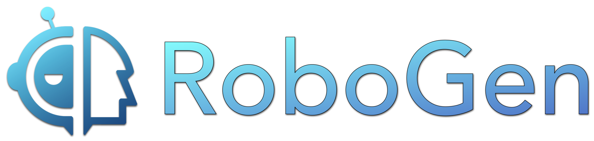
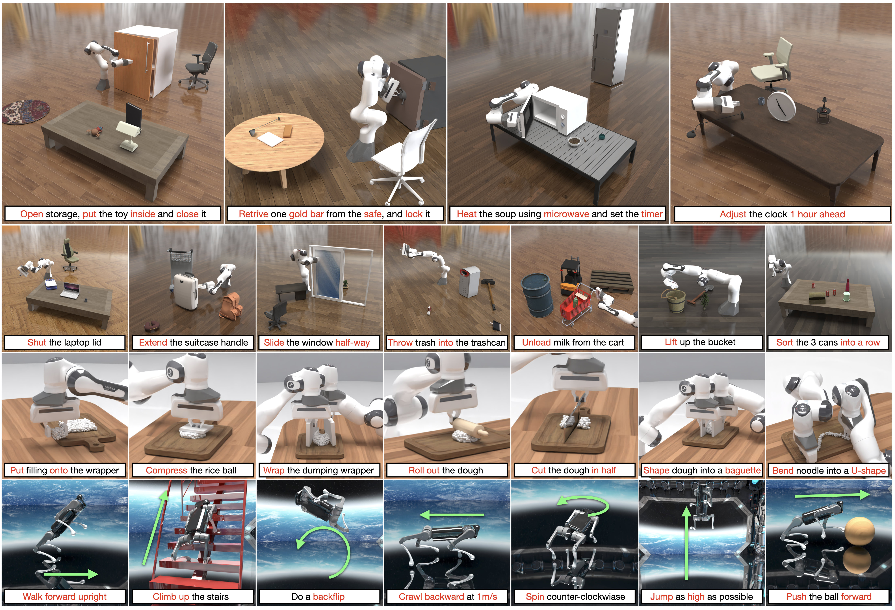

<div align="center">
  
  
  # RoboGen: Towards Unleashing Infinite Data for Automated Robot Learning via Generative Simulation
</div>

---
<div align="center">
  
</div> 

<p align="left">
    <a href='http://arxiv.org/abs/2311.01455'>
      
    </a>
    <a href='https://robogen-ai.github.io/'>
      
    </a>
</p>
This is the follow up of project of the paper:

> **[RoboGen: Towards Unleashing Infinite Data for Automated Robot Learning via Generative Simulation](https://robogen-ai.github.io/)**  
> [Yufei Wang*](https://yufeiwang63.github.io/), [Zhou Xian*](https://zhou-xian.com/), [Feng Chen*](https://robogen-ai.github.io/), [Tsun-Hsuan Wang](https://zswang666.github.io/), [Yian Wang](https://wangyian-me.github.io/), [
Katerina Fragkiadaki](https://www.cs.cmu.edu/~katef/), [Zackory Erickson](https://zackory.com/), [David Held](https://davheld.github.io/), [Chuang Gan](https://people.csail.mit.edu/ganchuang/)   

RoboGen is a **self-guided** and **generative** robotic agent that autonomously proposes **new tasks**, generates corresponding **environments**, and acquires **new robotic skills** continuously.

This follow-up project aims at distilling all the data generated by RoboGen into a unified policy that can generalize. We are now focusing on the task of opening articulated objects and generalizing to all kinds of different drawers, cabinets, fridges, microwaves, etc. 

The project consists of 3 parts:
- Generating a large amount of data in simulation for opening all kinds of articulated objects (e.g., all articulated objects in PartNet Mobility). 
- Training a single policy that can consume and learn well on all the generated data.
- Transfer the trained policy to the real world.

Ultimately, we want to have a policy checkpoint where every lab can download from all over the world and they can just use the policy checkpoint to open the articulated objects in their labs. 

Up to this point (Aug 17th, 2024), we have finished:  
- the pipeline for quickly generating the demonstrations in simulation, using motion planning and sampling-based grasping
- we have tried and tested several policy learning architectures:
  - DP3
  - 3D diffuser actor
  - DP3 combined with rotary self attention and all different kinds of encoders
  - End-to-end and a hierarchical policy. 
- we have initial real-world test results. 

## Installation
Clone this git repo.
We recommend working with a conda environment.
```
conda env create -f environment.yaml
conda activate robogen
```

Then install all packages needed for running DP3, following the guide here: https://github.com/YanjieZe/3D-Diffusion-Policy/blob/master/INSTALL.md. 
NOTE: you can skip the steps 1, 2, 4, 5, 7, 8 in the installation steps of dp3. 


### Open Motion Planning Library
OMPL is only needed for generating the demonstrations. It is not needed for training the policy.

If your system is ubuntu 20.04 or higher, use the prebuilt python wheels at here: https://github.com/ompl/ompl/releases/tag/prerelease. Down the prebuilt wheels that match your system and python version, and then `pip install your_downloaded_wheel` (do this in the robogen conda env). 
For more info, check [this issue](https://github.com/Genesis-Embodied-AI/RoboGen/issues/8#issuecomment-1918092507).

If your system is ubuntu 18.04
To install OMPL, run
```
./install_ompl_1.5.2.sh --python
```
which will install the ompl with system-wide python. Note at line 19 of the installation script OMPL requries you to run `sudo apt-get -y upgrade`. A successful installation will take 5-6 hours. If not, that means your installtaion is not complete. If the installation is not complete, try installing by running the commands in install_ompl_1.5.2.sh line by line. 
Then, export the installation to the conda environment to be used with RoboGen:
```
echo "path_to_your_ompl_installation_from_last_step/OMPL/ompl-1.5.2/py-bindings" >> ~/miniconda3/envs/robogen/lib/python3.9/site-packages/ompl.pth
```
remember to change the path to be your ompl installed path and conda environment path.

### Dataset
We use [PartNet-Mobility](https://sapien.ucsd.edu/browse) for task generation and scene population. We provide a parsed version [here](https://drive.google.com/file/d/1d-1txzcg_ke17NkHKAolXlfDnmPePFc6/view?usp=sharing) (which parses the urdf to extract the articulation tree as a shortened input to GPT-4). After downloading, please unzip it and put it in the `data` folder, so it looks like `data/dataset`.


## Training policy
see `scripts_ziyu/run-50-act3d-goal.sh` for training the high-level policy.  
see `chialiang_scripts/run-act3d-ddp-psc.sh` for training the low-level policy. 
You can use `3d_diffusion_policy/3D-Diffusion-Policy/3D-Diffusion-Policy/train_ddp.py` as an entry point for reading through the training code. 

To eval a trained low-level policy and a trained high-level policy, use
`3d_diffusion_policy/3D-Diffusion-Policy/3D-Diffusion-Policy/train_ddp.py`

To eval a trained low-level policy with heuristic ground-truth goal switching, use
`3d_diffusion_policy/3D-Diffusion-Policy/3D-Diffusion-Policy/eval_robogen_parallel_new.py`

## generating data
checkout to branch `seuss_gen_data`, and then see `launch/run_seuss.py` for generating the training demonstrations. `manipulation/gen_demo/gen_demo.py` is the main file for generating the demos. 
All demo generation functions (e.g., motion planning, sampling-based grasping) are implemented in `manipulation/gpt_primitive_api.py`. 
The simulation environment is implemented in `manipulation/sim.py`.
The point cloud observation wrapper is in `manipulation/robogen_wrapper.py`


## Some tests to run to understand the code & make sure the code runs correctly
Here we show some commands & basic experiments that you should run to make sure the code is running correctly, and for you to understand the code (e.g., you can use pdb to go through the code step by step when running the following commands). 

- If you are running this in a local machine, i.e., you have copied data from autobot / robo cluster back to your local desktop:
```
bash scripts/run-50-act3d-goal.sh
```
This will train a high-level policy that predicts the goal gripper points, using 50 objects. 
By default the experiment is named `test-50-obj-pred-goal-gripper-pointnet-backbone-unet-diffusion-epsilon`. The checkpoints and log of this training will be stored at `3d_diffusion_policy/3D-Diffusion-Policy/3D-Diffusion-Policy/data/test-50-obj-pred-goal-gripper-pointnet-backbone-unet-diffusion-epsilon`.

Let this train for 30ish epochs. You can then evaluate this trained high-level policy with a pre-trained low-level policy on 10 unseens objects, each with 25 different configurations, using:
```
cd 3d_diffusion_policy/3D-Diffusion-Policy/3D-Diffusion-Policy/
python eval_robogen_with_goal_prediction.py
```
NOTE: this evaluation requires access to some of the raw data for demonstration generations, which is stored in autobot at 
```
'/project_data/held/yufeiw2/RoboGen_sim2real/data/diverse_objects/open_the_door_40147/'
'/project_data/held/yufeiw2/RoboGen_sim2real/data/diverse_objects/open_the_door_44817/'
'/project_data/held/yufeiw2/RoboGen_sim2real/data/diverse_objects/open_the_door_44962/'
'/project_data/held/yufeiw2/RoboGen_sim2real/data/diverse_objects/open_the_door_45132/'
'/project_data/held/yufeiw2/RoboGen_sim2real/data/diverse_objects/open_the_door_45219/'
'/project_data/held/yufeiw2/RoboGen_sim2real/data/diverse_objects/open_the_door_45243/'
'/project_data/held/yufeiw2/RoboGen_sim2real/data/diverse_objects/open_the_door_45332/'
'/project_data/held/yufeiw2/RoboGen_sim2real/data/diverse_objects/open_the_door_45378/'
'/project_data/held/yufeiw2/RoboGen_sim2real/data/diverse_objects/open_the_door_45384/'
'/project_data/held/yufeiw2/RoboGen_sim2real/data/diverse_objects/open_the_door_45463/'
```
You need to scp those to your local machine if you want to evaluate on your local machine. 

In eval_robogen_with_goal_prediction.py, change `goal_check_point_name` and `goal_exp_dir` to be the path of the experiments where you just run. Change `save_path` at the bottom part of the file to be your desired name, e.g., `test_eval`. The evaluation results will be stored at `3d_diffusion_policy/3D-Diffusion-Policy/3D-Diffusion-Policy/data/test_eval/`. 
To parse the results, run `python plot/plot_directory.py --directory 3d_diffusion_policy/3D-Diffusion-Policy/3D-Diffusion-Policy/data/test_eval/`.
This will give you the performance of each of the 10 objects, where 1 means that the performance perfectly matches the expert policy, and 0 means it does nothing. 
Ideally, you should be able to see results similar to this google sheet: https://docs.google.com/spreadsheets/d/1EMFSzEfIVoG6cQwVil9FqNFOaoY4T2LIXywdIaU_58o/edit?usp=sharing, under tab `50 objects`, block L58 - L67.

- For running experiments on autobot:
Everything is similar to above except that you need to run things in a singularity image.
Singularity is similar to docker, which is a container that has all required environments installed inside it for an application. It is commonly used for high-performance computing clusters, and all 3 of our lab clusters support it, i.e., seuss, autobot, and robo cluster. 
We have already built a singularity image that has all needed environment and conda packages installed for running the code.
It is located at `/project_data/held/yufeiw2/robogen-dp3-act3d.sif` on autobot. 
Feel free to ask ChatGPT more info about singularity if you are interested. 

To run things on autobot, you need to run it inside this singularity, so do the following:
- You should first ssh into a compute node, e.g., ssh autobot-0-33
- Then you can either start a tmux session or not. tmux can prevent your job from dying if you lose connection during the ssh session
- Activate the singularity `singularity shell --bind /project_data/held/yufeiw2/RoboGen_sim2real/:/mnt/RoboGen_sim2real/ --nv /project_data/held/yufeiw2/robogen-dp3-act3d.sif`
- Prepare some environment vairables and activate the conda env inside the singularity: 
```
cd /mnt/RoboGen_sim2real
export PATH=/opt/conda/bin:$PATH
source /opt/conda/etc/profile.d/conda.sh
conda activate unisim
export PYTHONPATH=${PWD}:$PYTHONPATH
export PYTHONPATH=${PWD}/rl_games:$PYTHONPATH
export PYTHONPATH=${PWD}/3d_diffusion_policy/3D-Diffusion-Policy/3D-Diffusion-Policy:$PYTHONPATH
export PROJECT_DIR=${PWD}
source prepare.sh
export YUFEI_OPENAI_API_KEY="xxx" # TODO: embed this in singularity
```
- After this, you should be good to go for training. Just do `bash scripts/run-50-act3d-goal.sh` and everything else follows as running things locally. 


